# 🚀 QueueFlow – Real‑Time Task Queue & Team Collaboration Platform

[](https://react.dev/)
[](https://reactrouter.com/)
[](https://vitejs.dev/)
[](https://redux-toolkit.js.org/)
[](https://tailwindcss.com/)
[](https://socket.io/)
[](https://github.com/Anoop-Kumar-31/QueueFlow_Frontend)

---

QueueFlow is a real-time project management platform built for modern development teams. It connects Project Managers, Developers, and Clients inside shared live workspaces — with drag-and-drop Kanban boards, sticky-note feedback, a workflow intelligence analytics engine, and a real-time activity feed, all syncing instantly via WebSockets without a page refresh.

This repository is the **React frontend** — a Vite + Redux Toolkit SPA that consumes QueueFlow's REST API and Socket.io backend.

---

## 📸 Sneak Peek

### Authentication
#### Login
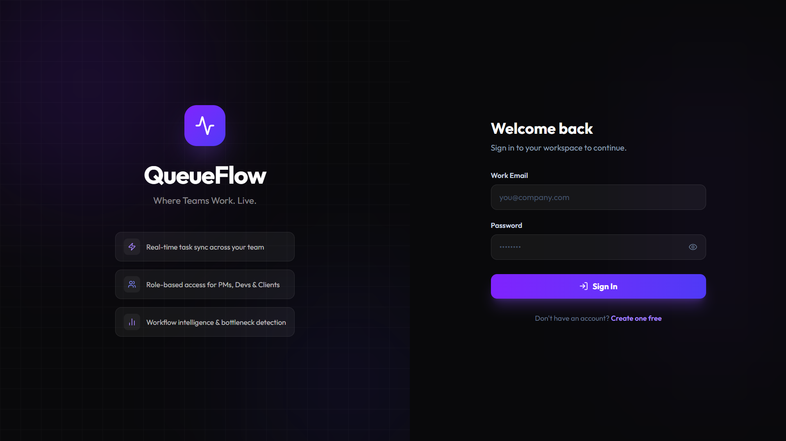

#### Sign Up
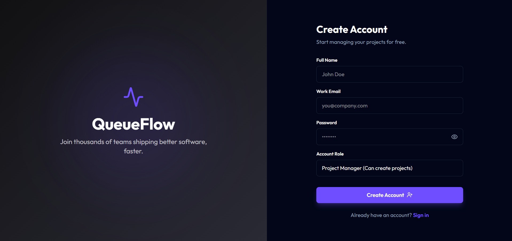

### Dashboard & Projects
#### Overview Dashboard
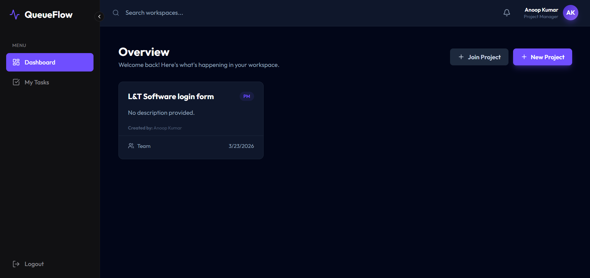

#### Project Board
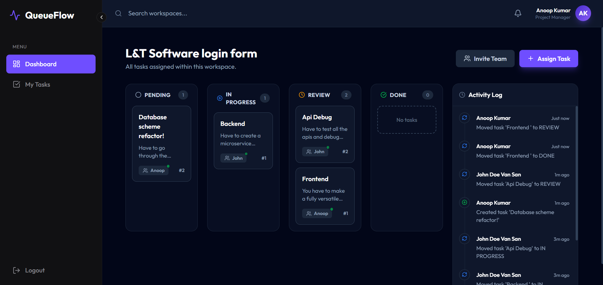

### Task Management
#### My Tasks
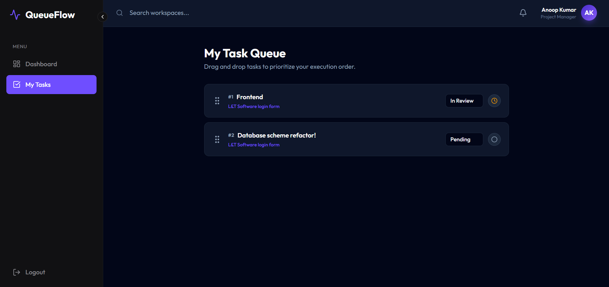

#### Task Details & Sticky Notes
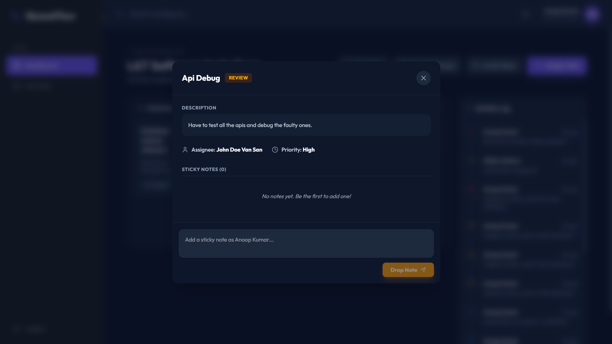

### Collaboration
#### Join via Project Code
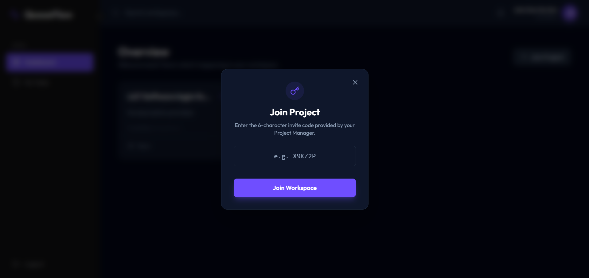

#### Generated Invite Code
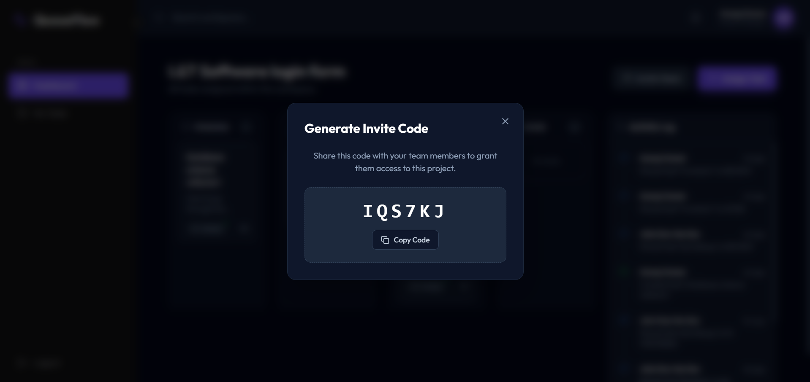

#### Code Time Limit
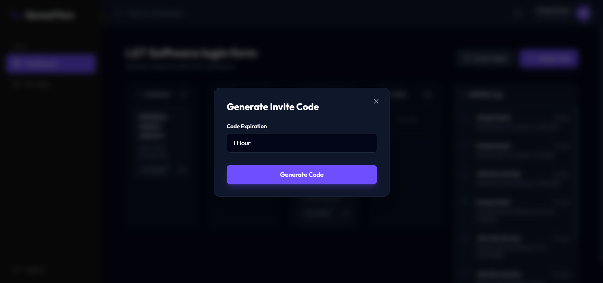

### Access Management & Analytics
#### Manage Access (PM)
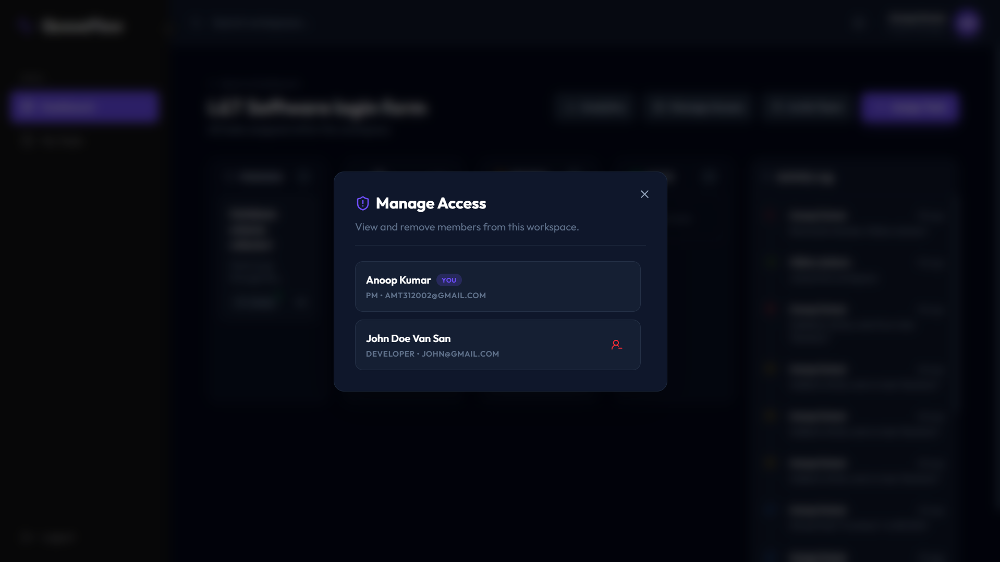

#### Analytical Overview
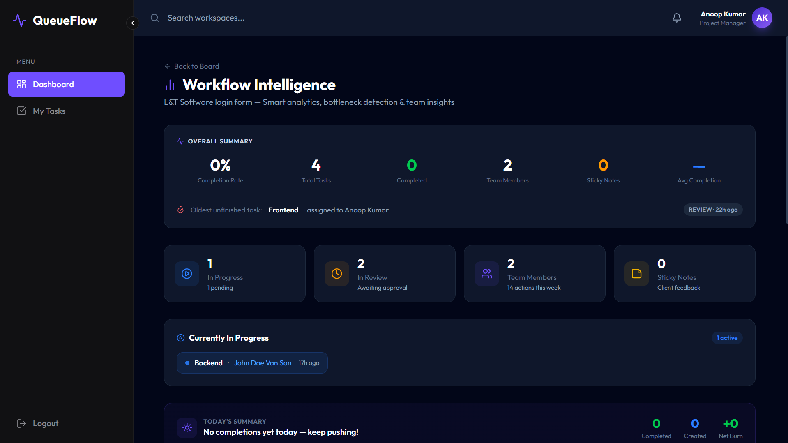

---

## 👔 How It Works

QueueFlow is built around a strict role-based flow:

1. **Project Manager** creates a workspace and generates a time-limited **6-character invite code** (valid for up to 6 hours).
2. **Developers / Clients** enter the code from the Join screen and are instantly added to the workspace.
3. **Developers** drag tasks across `PENDING → IN PROGRESS → REVIEW → DONE` — every move is broadcast in real time to all members.
4. **Clients** get a live read-only view of progress and can leave sticky-note feedback directly on tasks.
5. **Project Managers** monitor the **Activity Timeline**, check the **Analytics Dashboard** for bottlenecks and workload imbalances, and manage team access — all without leaving the app.

---

## ✨ Core Features

| Feature | Description |
|---|---|
| 🎯 **Role-Based Access** | PMs create projects, Developers work tasks, Clients view and leave feedback — each role sees exactly what it needs |
| 📋 **Live Kanban Board** | Drag-and-drop tasks across `PENDING → IN PROGRESS → REVIEW → DONE`, updates broadcast instantly to all members |
| 🔔 **Notification Bell** | Real-time notification feed in the header — shows teammate actions with unread badge counter, filtered to exclude your own events |
| 🔍 **Live Search** | Instant client-side search across all projects and tasks from the header bar |
| 📊 **Workflow Intelligence** | Analytics dashboard with bottleneck detection, workload imbalance alerts, in-progress task chips, priority breakdown, completion trends, and smart insights |
| 🗒️ **Sticky Notes** | Per-task feedback layer — post, edit, and delete notes in real time inside the Task Details modal |
| 👥 **Access Management** | PMs get a Manage Access panel to view and remove members; Developers/Clients get a Leave Team option with confirmation |
| 📜 **Activity Timeline** | Real-time vertical feed of all workspace events — task moves, notes, members joining, and more |
| 🔗 **Invite Codes** | PMs generate time-limited invite codes; members join by entering the code from the dashboard |
| ⚡ **Loading Screen** | Animated boot screen with cycling status messages and a Render cold-start notice for first visits |

---

## 🚀 Why QueueFlow is Different

Most project management tools solve task tracking. QueueFlow solves workflow visibility and intelligence.

### Comparison
| Feature               | Existing Tools              | QueueFlow                         |
| --------------------- | --------------------------- | --------------------------------- |
| Real-time sync        | ❌ Polling / Refresh         | ✅ WebSockets (instant updates)    |
| Workflow intelligence | ❌ Minimal / Paid features   | ✅ Built-in insights & analytics   |
| Developer workflow    | ❌ Kanban boards only        | ✅ Time-ordered developer queues   |
| Client interaction    | ⚠️ Limited or unsafe access | ✅ Structured sticky-note feedback |
| Event system          | ❌ Hidden or partial logs    | ✅ Full event-driven architecture  |

---

## ⚙️ Tech Stack Decisions — Why This Stack?

QueueFlow is built with a real-time, event-driven architecture. Every technology was chosen deliberately to support live collaboration, data consistency, and performance.

### Quick Reference

| Layer | Technology | Key Reason |
|---|---|---|
| Runtime | Node.js + Express | Non-blocking I/O for concurrent sockets + REST |
| Real-time | Socket.io | Room-based broadcasting, auto-reconnect |
| Database | PostgreSQL (Supabase) | ACID, relational integrity, complex joins |
| ORM | Prisma | Type-safe queries, schema-first migrations |
| Frontend | React 18 + Vite | SPA-only, fast HMR, no SSR needed |
| State | Redux Toolkit | Predictable WebSocket-driven state mutations |
| Styling | Tailwind CSS v4 | Utility-first, dark mode, no design lock-in |
| Charts | Recharts | Native React, declarative, responsive containers |

---

### 🧠 Backend

#### 🟢 Node.js + Express

**Why used:**
- Non-blocking I/O — handles WebSocket events and REST API calls simultaneously on a single thread
- Lightweight and fast for real-time systems
- Perfect fit for an event loop model where every task move fires both a DB write AND a socket broadcast

**Why not alternatives:**
- **Django (Python):** Synchronous by default; needs Django Channels for WebSockets — added complexity
- **Spring Boot (Java):** Thread-per-request model → heavier memory usage; overkill here
- **Laravel (PHP):** Not designed for persistent real-time TCP connections

---

#### 🟢 Socket.io

**Why used:**
- Built-in **room-based broadcasting** — `io.to(projectId).emit()` ensures only relevant clients receive events
- Automatic reconnection and long-polling fallback built-in
- No need to rebuild connection state management from scratch

**Why not alternatives:**
- **Raw WebSockets:** No room abstraction, manual reconnect logic, no namespace support
- **Server-Sent Events (SSE):** One-way only (server → client); can't handle client-initiated events
- **Polling:** Minimum 2–5s latency, wasted requests even when nothing changes

---

#### 🟢 PostgreSQL via Supabase

**Why used:**
- Strong **relational integrity** — Tasks belong to Projects, Members reference Users, Activities soft-link deleted Tasks (`onDelete: SetNull`)
- ACID compliance: drag-and-drop reorders run as `prisma.$transaction()` — all or nothing
- Efficient `JOIN` queries power the analytics engine

**Why not alternatives:**
- **MongoDB:** Weak relational modeling; cross-collection joins for analytics are messy
- **MySQL:** Solid alternative, but PostgreSQL has better native support for complex queries, `RETURNING`, and Supabase's tooling

---

#### 🟢 Prisma ORM

**Why used:**
- Fully **type-safe** queries — no runtime SQL string errors
- Schema-first: one `schema.prisma` file is the single source of truth for the entire DB structure
- First-class Supabase support (`url` + `directUrl` for connection pooling)

**Why not alternatives:**
- **Sequelize:** Class-based, older API, weaker type inference
- **TypeORM:** Decorator-heavy, more config, inconsistent behavior with some Postgres features
- **Raw SQL:** No migration tooling, no type safety

---

### 🎨 Frontend

#### 🟢 React 18 + Vite

**Why used:**
- QueueFlow is a **fully authenticated SPA** — no page needs to be server-rendered for SEO
- Vite's dev server starts in <1s vs Webpack/CRA's 10–30s
- React's component model pairs naturally with Redux socket reducers

**Why not alternatives:**
- **Next.js:** SSR/ISR adds complexity with zero benefit here; all routes require login
- **Angular:** More opinionated; React's ecosystem (Redux, Recharts, Lucide) is better suited
- **Vue:** Smaller ecosystem for the specific libraries used

---

#### 🟢 Redux Toolkit

**Why used:**
- Centralized store for three intersecting real-time data sources: `auth`, `projects`, `tasks`
- Socket reducers (`socketTaskUpdated`, `socketTaskCreated`) write directly into the store — no re-fetching needed
- `useSelector` with shallow equality prevents unnecessary re-renders

**Why not alternatives:**
- **Context API:** Re-renders every consumer on every value change — catastrophic at socket event frequency
- **React Query / SWR:** Built for pull-based (polling/caching) patterns; conflicts with push-based socket updates (two competing sources of truth)
- **Zustand:** Valid alternative, but Redux DevTools extensibility was preferred for debugging socket state flows

---

#### 🟢 Tailwind CSS v4

**Why used:**
- Utility-first means dark mode (`dark:`), responsive breakpoints, and custom color tokens all live inline — no context switching
- JIT compilation makes the final CSS bundle tiny
- No design lock-in; every component looks exactly as designed

**Why not alternatives:**
- **CSS Modules:** More files, slower iteration, harder to share design tokens
- **Chakra UI / MUI:** Opinionated design system limits the premium custom look we needed
- **styled-components:** Runtime CSS injection, worse Vite HMR performance

---

#### 🟢 Recharts

**Why used:**
- **Native React integration** — no imperative DOM manipulation, components compose just like any other JSX
- `<ResponsiveContainer>` handles layout automatically
- Declarative API: `<LineChart><Line/></LineChart>` maps directly to the data model

**Why not alternatives:**
- **Chart.js:** Imperative API requires `useEffect` and `useRef` to fight React's declarative model
- **D3.js:** Extremely powerful but too low-level — you'd rebuild everything Recharts provides
- **Victory:** Less active maintenance, weaker TypeScript support

---

### 🧠 Key Takeaway

```
Real-time push architecture  →  Node.js + Socket.io
Relational data integrity     →  PostgreSQL + Prisma
Predictable live state        →  Redux Toolkit
Fast, flexible UI             →  React + Vite + Tailwind
```

Every choice supports a **live, collaborative, intelligent** workflow system — not just a CRUD app.

---

## 📦 Local Setup & Installation

### 1. Clone the repository
```bash
git clone https://github.com/Anoop-Kumar-31/QueueFlow_Frontend.git
cd QueueFlow_Frontend
```

### 2. Install Dependencies
```bash
npm install
```

### 3. Environment Configuration
Create a `.env` file in the root folder pointing directly to your local backend server:
```env
VITE_API_URL=http://localhost:5000/api
```

### 4. Boot the Server
```bash
npm run dev
```
Navigate to `http://localhost:5173` to interact with QueueFlow!

---

**Anoop Kumar | Full Stack Developer**
